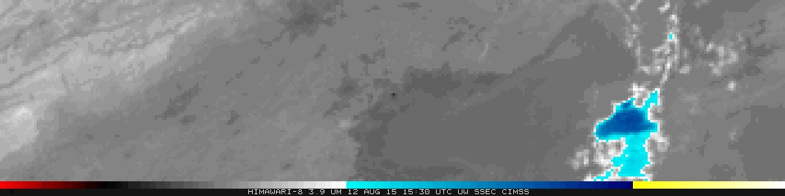
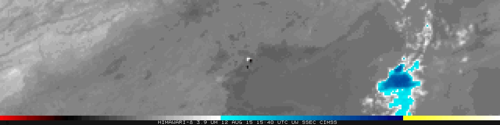
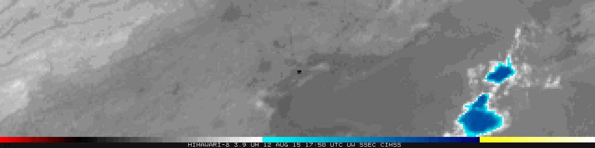
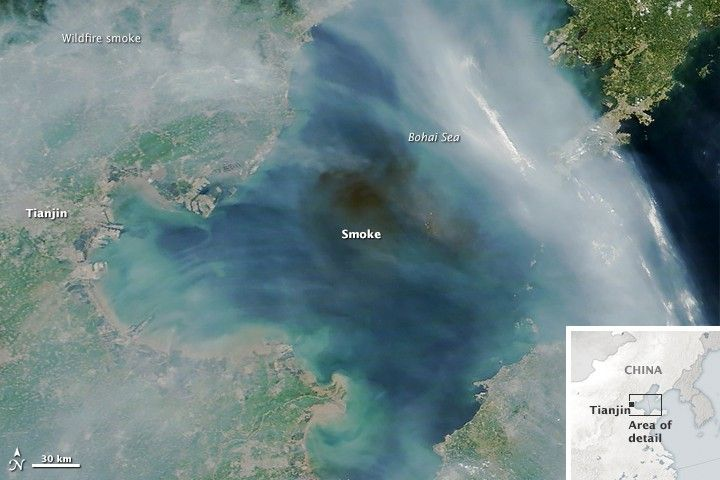
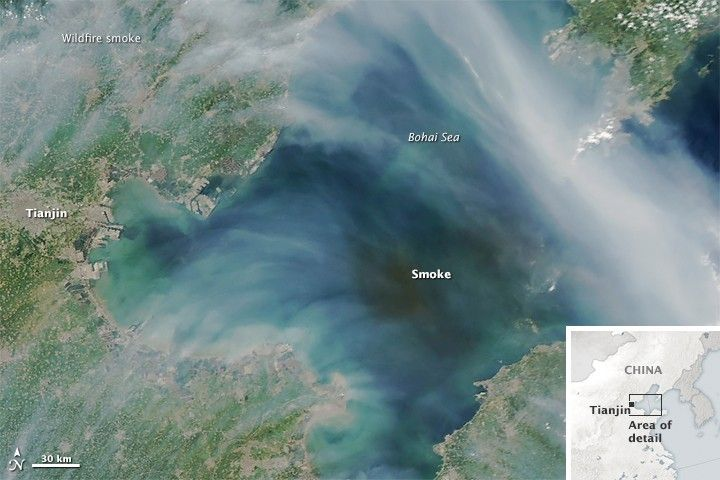
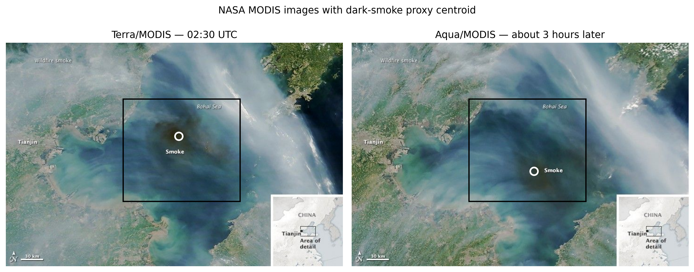
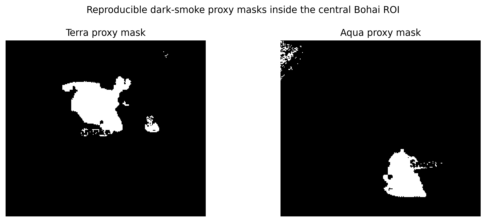
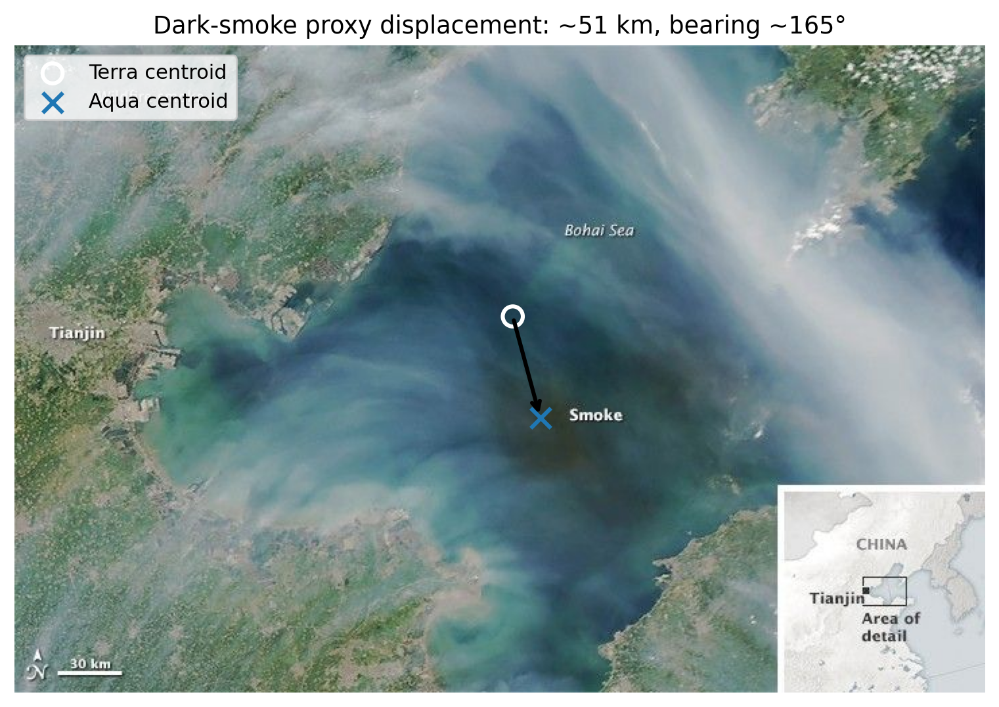
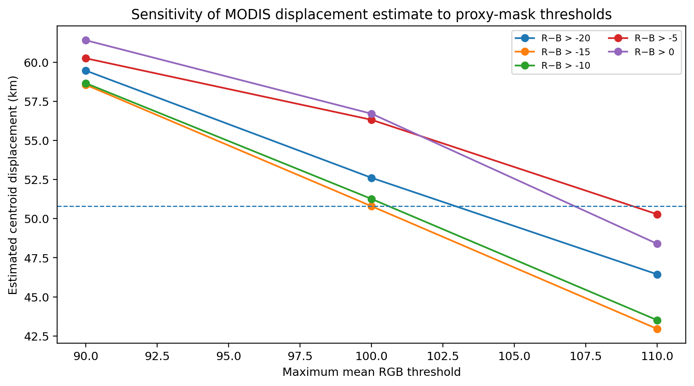

# Reconstructing the Tianjin Explosion from Space

### A Remote-Sensing OSINT Event Reconstruction

On 12 August 2015, two major explosions struck the Ruihai hazardous materials warehouse in Tianjin. The official investigation records the first explosion at **23:34:06 local time (15:34:06 UTC)** and the second at **23:34:37 local time (15:34:37 UTC)**.

[](https://www.youtube.com/watch?v=993wlZ6XFSs)

*Ground-level context: eyewitness footage published by BBC News.*

The same event was observed from space. CIMSS published a shortwave-infrared animation combining **Himawari-8 (3.9 µm), MTSAT-2 (3.75 µm), and COMS-1 (3.75 µm)**. CIMSS states that all three satellites viewed the explosion and that it generated a strong shortwave-infrared thermal signature. The animation also records the atmospheric evolution after the event.

The following morning, NASA's **Terra/MODIS** instrument observed a dark smoke plume over the Bohai Sea at **02:30 UTC on 13 August**. NASA reports that **Aqua/MODIS** observed the plume again **about three hours later**, after it had moved southeast.

The investigation combines the timestamped Himawari-8 observations with NASA Terra and Aqua imagery to reconstruct the satellite-observed aftermath. The NASA images are then used to estimate how far the visible smoke plume shifted between the two later observations.

This investigation asks:

> **Can open satellite records independently reconstruct the Tianjin event, distinguish the immediate event-site signal from ordinary nearby variation, and quantify the later displacement of the visible smoke plume?**

This repository deliberately separates two evidence phases rather than pretending that they form a continuous homogeneous time series:

1. **Immediate event record — 12 August:** CIMSS shortwave-infrared satellite sequence.
2. **Later atmospheric aftermath — 13 August:** NASA Terra and Aqua MODIS imagery.

The analysis is a **remote-sensing OSINT event reconstruction**: it reconstructs the observable event chronology and later atmospheric aftermath, without claiming a continuous plume trajectory across the night.

---

## Evidence set

| ID | Time (UTC) | Source | What it establishes |
|---|---:|---|---|
| **H1** | 12 Aug 15:30 | Himawari-8 / 3.9 µm SWIR | Immediate pre-explosion comparison, four minutes before the recorded explosions |
| **H2** | 12 Aug 15:40 | Himawari-8 / 3.9 µm SWIR | First selected Himawari frame after both recorded explosions |
| **H3** | 12 Aug 17:50 | Himawari-8 / 3.9 µm SWIR | Later state in the same Himawari sequence |
| **N1** | 13 Aug 02:30 | Terra / MODIS imagery | Dark smoke plume over the Bohai Sea |
| **N2** | 13 Aug, about three hours after 02:30 UTC | Aqua / MODIS imagery | Later plume; proxy-centroid displacement is ~40–60 km south-southeast from N1 |

**For H1–H3, the primary chronology uses only the top Himawari-8 panel. The full three-panel composites are retained because MTSAT-2 and COMS-1 have different timestamps and must not be treated as simultaneous with Himawari.**

The source animation is preserved in [`images/himawari/`](images/himawari/), and the selected frames are extracted reproducibly with [`scripts/extract_cimss_gif.py`](scripts/extract_cimss_gif.py).

## Key findings

- Timestamped Himawari-8 imagery documents the immediate satellite-observed aftermath of the Tianjin explosions.
- A later Himawari-8 observation shows the scene continuing to evolve.
- NASA Terra imagery shows a dark smoke plume over the Bohai Sea the following morning.
- Aqua observes the plume again about three hours later, farther to the south-southeast.
- From the rendered NASA images, the visible plume core is estimated to have shifted roughly **40–60 km** between the two observations.

---

# 1. Establishing the event time

The English-language *Process Safety Progress* investigation summary places the Ruihai hazardous materials warehouse at **39°02′22.98″ N, 117°44′11.64″ E**. In **“Accident Details and Its Impacts”**, it states that the fire began at 10:51 PM local time and was followed by two violent explosions. In **“First Response”**, it gives the exact local explosion times as **11:34:06 PM** and **11:34:37 PM**, describing the second as more violent.

A later open-access *Remote Sensing* study independently reproduces the chronology in 24-hour notation: **23:34:06 local time (UTC+8)** for the first explosion and **23:34:37** for the second, 31 seconds later.

Converted from China Standard Time (UTC+8), the two major explosions occurred at:

- first explosion: **15:34:06 UTC**;
- second, larger explosion: **15:34:37 UTC**.

Sources:

- AIChE / *Process Safety Progress*: https://aiche.onlinelibrary.wiley.com/doi/10.1002/prs.11830
- *Remote Sensing* (2024): https://www.mdpi.com/2072-4292/16/22/4241

The UTC values are **derived conversions in this repository**: eight hours are subtracted from the cited local times. Because the event times come from sources independent of the satellite imagery, they provide the temporal anchor for the H1 → H2 comparison.

---

# 2. Observing the event from space

CIMSS published a shortwave-infrared animation containing observations from Himawari-8, MTSAT-2 and COMS-1. The three panels have their own embedded timestamps, so they should not be treated as simultaneous observations.

For the main chronology, this investigation uses the **Himawari-8 3.9 µm panel**.

CIMSS source article:  
https://cimss.ssec.wisc.edu/satellite-blog/archives/19209

Original animation:  
https://cimss.ssec.wisc.edu/satellite-blog/wp-content/uploads/sites/5/2015/08/HIMAWARI3PAN_NOMAP_12AUGUST2015_1500_1900anim.gif

## H1 — 15:30 UTC



The embedded Himawari-8 timestamp is **15:30 UTC**, before the two explosions at 15:34 UTC.

## H2 — 15:40 UTC



The embedded Himawari-8 timestamp is **15:40 UTC**, after the two explosions.

The comparison is used visually: it shows how the rendered shortwave-infrared scene around Tianjin differs across the event interval. Because the source is a rendered color product rather than calibrated radiance data, this investigation does **not** convert the displayed pixel values into temperature, energy or explosive yield.

# 3. Following the immediate aftermath

## H3 — 17:50 UTC



H3 is a **representative later observation** from the same Himawari-8 sequence. It is included to show that the satellite-observed scene continued to evolve after the explosions; it was not selected by an optimization rule.

The original three-panel CIMSS composites are retained in the repository so the embedded timestamps and source context can be checked directly.

---

# 4. Next-morning visible smoke

The shortwave-infrared sequence ends on 12 August. The next evidence phase comes from NASA MODIS natural-color imagery on 13 August.

NASA Earth Observatory:  
https://science.nasa.gov/earth/earth-observatory/smoke-over-the-bohai-sea-86410/

NASA states that fires associated with the Tianjin explosions sent dark smoke east and southeast.

## N1 — Terra/MODIS at 02:30 UTC



NASA states that Terra/MODIS acquired this observation at **02:30 UTC (10:30 local time)** on 13 August 2015.

The image independently establishes that a dark plume associated with the Tianjin fires was visible over the Bohai Sea the following morning.

## N2 — Aqua/MODIS, about three hours after Terra



NASA reports that Aqua/MODIS acquired a second observation **about three hours after Terra**, after the plume had moved southeast toward the Shandong Peninsula.

---

# 5. Terra → Aqua plume displacement

NASA states that Terra/MODIS observed the dark plume at **02:30 UTC on 13 August 2015** and that Aqua captured a second image **about three hours later**, after the plume had moved southeast toward the Shandong Peninsula.

The two NASA presentation images use the same 720×480 map frame. An ORB/RANSAC registration check on persistent image features returns an identity transform to numerical precision for the tested matches, supporting direct comparison in the shared pixel frame.



## Dark-smoke proxy

A reproducible proxy mask is restricted to the central Bohai Sea (`x=250–500`, `y=120–340`) to avoid most land, labels and the inset map. Pixels are retained when:

```text
R − B > -15
30 < mean(R,G,B) < 100
```

This rule is not a chemical smoke classifier. It is simply a transparent way to isolate the visually dark brown/gray plume core in the two rendered NASA images.



The proxy centroid moves from approximately:

```text
Terra: (369.3, 200.5) px
Aqua:  (389.7, 275.7) px
```

The displacement is **77.9 pixels**. Using the rendered **30 km** scale bar, measured at approximately **46 pixels** in the supplied NASA image, gives:

```text
scale ≈ 0.652 km/pixel
nominal centroid displacement ≈ 50.8 km
bearing ≈ 164.8°
```

In image coordinates this corresponds to approximately **13.3 km east** and **49.0 km south**. The derived direction is therefore south-southeast, consistent with NASA's qualitative description that the plume had moved southeast toward the Shandong Peninsula.



## Sensitivity

Because the mask operates on rendered RGB values, the estimate is tested across 15 reasonable threshold combinations. The resulting centroid displacement ranges from approximately **42.9 to 61.4 km**, with bearings from **154° to 171°**.



The **50.8 km / 164.8°** value is an image-derived estimate from the rendered NASA figures, not a measurement from georeferenced MODIS Level-1 data. The robust conclusion is therefore simply that the visually dark plume core shifted **roughly 40–60 km toward the south-southeast** between the two NASA observations.

This is an **apparent plume-centroid displacement**, not wind speed. The sensitivity test varies the proxy-mask thresholds; it does not quantify every source of uncertainty, such as the manually read scale bar or analysis-window placement.

Data:

```text
data/modis_plume_displacement_summary.csv
data/modis_plume_sensitivity.csv
data/modis_registration_check.csv
```

Reproduce:

```bash
python scripts/analyze_modis_displacement.py
```

---

# 6. What the evidence supports

The investigation supports a conservative two-phase reconstruction.

### Immediate event phase

- The cited local explosion times convert to **15:34:06 and 15:34:37 UTC**.
- Himawari-8 provides a rendered 3.9 µm SWIR observation at **15:30 UTC** and another at **15:40 UTC**, bracketing the explosion interval.
- The selected H3 observation at **17:50 UTC** shows a later state in the same Himawari sequence.

### Next-morning atmospheric phase

- Terra/MODIS independently shows a dark plume over the Bohai Sea at **02:30 UTC on 13 August**.
- Aqua/MODIS shows the plume in a later, more southerly position **about three hours after** the 02:30 UTC Terra observation.
- A reproducible rendered-RGB proxy places the nominal plume-core centroid displacement at **50.8 km, bearing 164.8°**.
- Across 15 threshold combinations, the displacement remains in a **42.9–61.4 km** range with bearings of **154–171°**.
- The robust result is therefore **tens of kilometres of apparent south-southeast plume-core displacement**, consistent with NASA's qualitative description of southeastward movement toward the Shandong Peninsula.

The analysis does **not** fill the overnight observational gap with an inferred trajectory.

---

# 7. What the evidence does **not** support

This repository does **not** claim a continuous satellite-derived trajectory from 15:34 UTC on 12 August to the MODIS observations on 13 August.

The current evidence does not justify deriving:

- a continuous plume trajectory or centroid speed across the overnight observational gap;
- wind speed from the Terra→Aqua apparent centroid displacement;
- physical temperature, radiance, energy, or explosive yield from the rendered SWIR GIF;
- chemical composition or toxicity of the visible plume;
- blast pressure or structural damage from these atmospheric products;
- an exact Aqua acquisition time: the NASA Earth Observatory source used here states only **“about three hours later.”**

The CIMSS imagery is shortwave infrared; the NASA Earth Observatory images are rendered MODIS observations. They are complementary observations, not interchangeable measurements.

---


# 8. Reproducibility

The original CIMSS GIF is stored unchanged at:

```text
images/himawari/HIMAWARI3PAN_NOMAP_12AUGUST2015_1500_1900anim.gif
```

Extract every GIF frame and regenerate H1–H3 with:

```bash
python scripts/extract_cimss_gif.py
```

Selected frame definitions are stored in:

```text
data/selected_frames.csv
```

The event chronology is stored in:

```text
data/event_timeline.csv
```

Source provenance is stored in:

```text
data/sources.csv
```

Quantitative Himawari outputs are stored in:

```text
data/H1_H2_H3_metrics.csv
data/himawari_roi_timeseries.csv
data/matched_control_rois.csv
data/control_validation_summary.csv
```

MODIS displacement outputs are stored in:

```text
data/modis_registration_check.csv
data/modis_plume_displacement_summary.csv
data/modis_plume_sensitivity.csv
```

Reproduce the two quantitative phases with:

```bash
python scripts/analyze_modis_displacement.py
```

File hashes are stored in:

```text
data/checksums.sha256
```

---


# Sources

**CIMSS Satellite Blog — Explosion in Tianjin, China**  
https://cimss.ssec.wisc.edu/satellite-blog/archives/19209

**CIMSS — original three-satellite SWIR animation**  
https://cimss.ssec.wisc.edu/satellite-blog/wp-content/uploads/sites/5/2015/08/HIMAWARI3PAN_NOMAP_12AUGUST2015_1500_1900anim.gif

**NASA Earth Observatory — Smoke over the Bohai Sea**  
https://science.nasa.gov/earth/earth-observatory/smoke-over-the-bohai-sea-86410/

**AIChE / Process Safety Progress — Tianjin Explosion Investigation Report Summary**  
https://aiche.onlinelibrary.wiley.com/doi/10.1002/prs.11830

**Process Safety Progress — Anatomy of Tianjin Port fire and explosion: Process and causes**  
https://aiche.onlinelibrary.wiley.com/doi/10.1002/prs.11837

**BBC News eyewitness video**  
https://www.youtube.com/watch?v=993wlZ6XFSs

**Bellingcat RS4OSINT — methodological inspiration**  
https://bellingcat.github.io/RS4OSINT/C3_Blast.html

---

## Methodological note

This repository preserves the original source imagery, keeps embedded timestamps visible, separates observations from derived measurements, and states observational gaps rather than interpolating across them.
