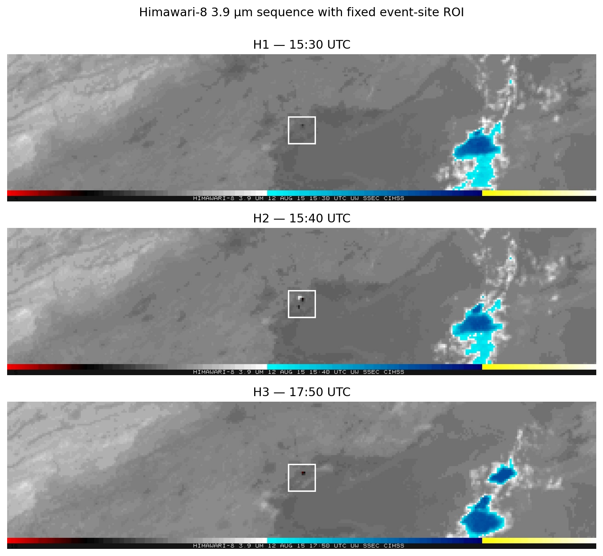
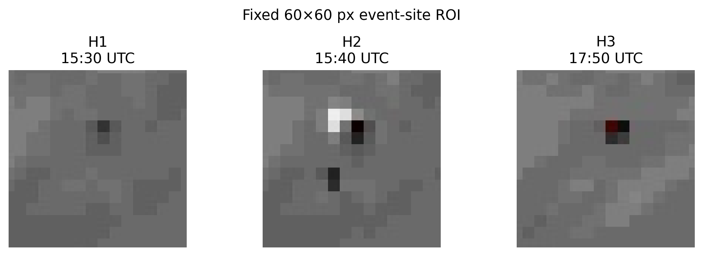
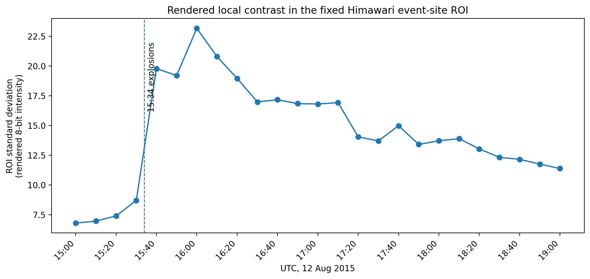
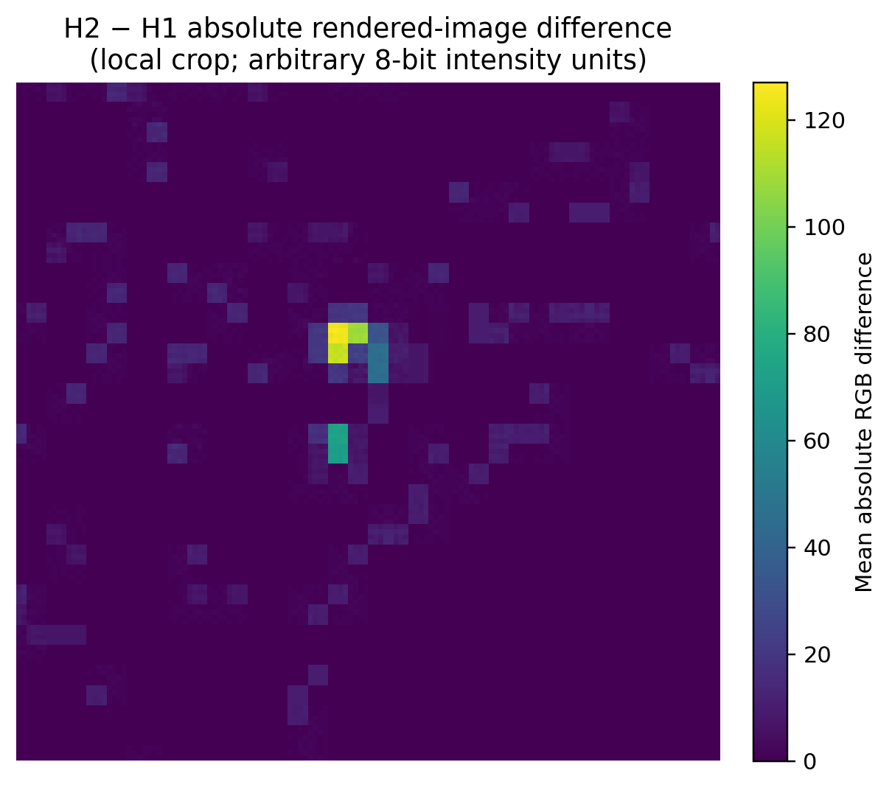
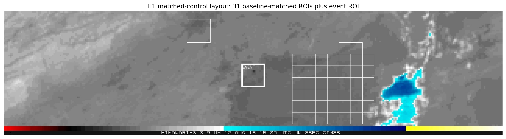
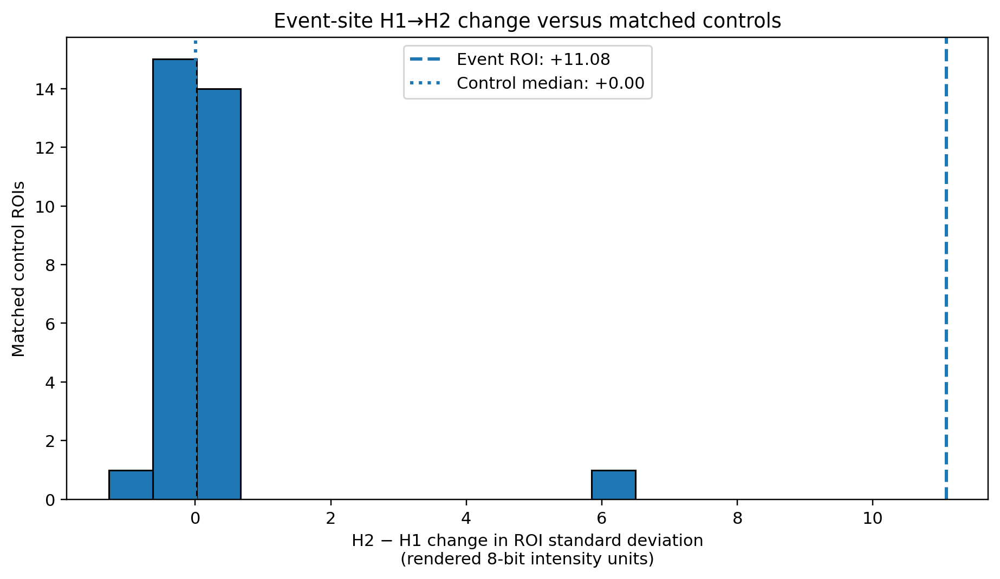
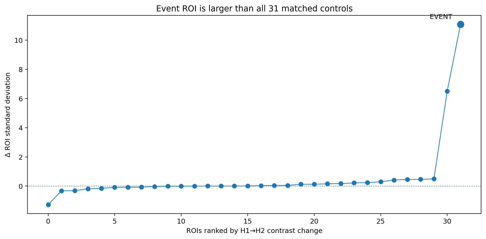
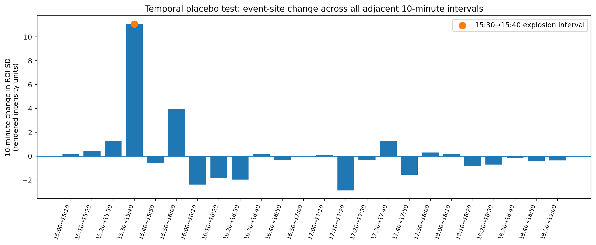
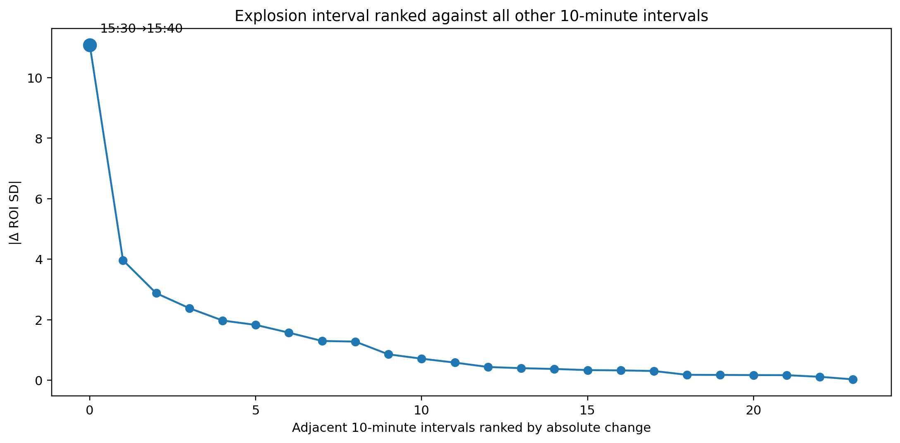

# Tracking the Tianjin Explosion from Space

### A reproducible RSOSINT reconstruction using shortwave-infrared change detection, matched controls, and MODIS plume displacement

On 12 August 2015, two major explosions struck the Ruihai hazardous-goods warehouse in Tianjin. The official investigation records the first explosion at **23:34:06 local time (15:34:06 UTC)** and the second at **23:34:37 local time (15:34:37 UTC)**.

[](https://www.youtube.com/watch?v=993wlZ6XFSs)

*Ground-level context: eyewitness footage published by BBC News.*

The same event was observed from space. CIMSS published a shortwave-infrared animation combining **Himawari-8 (3.9 µm), MTSAT-2 (3.75 µm), and COMS-1 (3.75 µm)**. CIMSS states that all three satellites viewed the explosion and that it generated a strong shortwave-infrared thermal signature. The animation also records the atmospheric evolution after the event.

The following morning, NASA's **Terra/MODIS** instrument observed a dark smoke plume over the Bohai Sea at **02:30 UTC on 13 August**. NASA reports that **Aqua/MODIS** observed the plume again **about three hours later**, after it had moved southeast.

Two quantitative checks are added to this chronology:

- the **15:30 → 15:40 Himawari-8 rendered-SWIR change** at the event site is compared against **31 matched control ROIs**;
- the **Terra → Aqua displacement** of a reproducibly defined dark-plume proxy is measured in the common NASA image frame and tested across multiple threshold settings.

The first test finds that the event-site H1→H2 contrast increase is larger than all 31 matched controls. The second places the later visible plume-core displacement at roughly **40–60 km toward the south-southeast**, with a nominal estimate of **50.8 km at 164.8°**.

This investigation asks:

> **Can open satellite records independently reconstruct the Tianjin event, distinguish the immediate event-site signal from ordinary nearby variation, and quantify the later displacement of the visible smoke plume?**

This repository deliberately separates two evidence phases rather than pretending that they form a continuous homogeneous time series:

1. **Immediate event record — 12 August:** CIMSS shortwave-infrared satellite sequence.
2. **Later atmospheric aftermath — 13 August:** NASA Terra and Aqua MODIS imagery.

The analysis therefore reconstructs an **event chronology**, not a continuous plume trajectory across the entire night.

---

## Evidence set

| ID | Time (UTC) | Source | What it establishes |
|---|---:|---|---|
| **H1** | 12 Aug 15:30 | Himawari-8 / 3.9 µm SWIR | Immediate pre-explosion comparison, four minutes before the recorded explosions |
| **H2** | 12 Aug 15:40 | Himawari-8 / 3.9 µm SWIR | First selected Himawari frame after both recorded explosions |
| **H3** | 12 Aug 17:50 | Himawari-8 / 3.9 µm SWIR | Later state in the same Himawari sequence |
| **N1** | 13 Aug 02:30 | Terra / MODIS imagery | Dark smoke plume over the Bohai Sea |
| **N2** | 13 Aug, about three hours after 02:30 UTC | Aqua / MODIS imagery | Later plume; proxy-centroid displacement is ~40–60 km south-southeast from N1 |

**For H1–H3, the primary chronology uses only the top Himawari-8 panel. The full three-panel composites are retained because MTSAT-2 and COMS-1 have different timestamps and must not be treated as simultaneous with Himawari.**

The source animation is preserved in [`images/himawari/`](images/himawari/), and the selected frames are extracted reproducibly with [`scripts/extract_cimss_gif.py`](scripts/extract_cimss_gif.py).

## Key findings

- The fixed event-site ROI's rendered local-contrast metric rises from **8.70 at 15:30 UTC to 19.78 at 15:40 UTC**, a **~127% increase** across the independently known explosion interval.
- The same H1→H2 contrast change is **larger than all 31 matched control ROIs**;
- In the temporal placebo, the 15:30→15:40 interval ranks **#1 of 24** by absolute 10-minute change and **#1 of 24** by signed increase; controls range from **−1.28 to +6.50**, versus **+11.08** at the event site.
- The event-site signal remains elevated at H3 (**13.41** at 17:50 UTC), while the full 10-minute series shows continued evolution after the explosions.
- Terra and Aqua use an effectively identical 720×480 presentation frame, allowing direct pixel comparison after an ORB/RANSAC registration check.
- A threshold-sensitive dark-plume proxy gives a nominal Terra→Aqua centroid displacement of **50.8 km at 164.8°**. Across 15 reasonable threshold combinations, estimates range from **42.9–61.4 km** and **154–171°**.
- The robust MODIS conclusion is therefore **roughly 40–60 km of apparent plume-core displacement toward the south-southeast**, not an exact trajectory and not wind speed.

---

# 1. Establishing the event time

The official accident investigation gives the warehouse location as **39°02′22.98″ N, 117°44′11.64″ E** and records:

- first explosion: **15:34:06 UTC**;
- second, larger explosion: **15:34:37 UTC**.

Source:  
https://aiche.onlinelibrary.wiley.com/doi/10.1002/prs.11830

These times are external to the satellite imagery and therefore provide an independent temporal anchor.

---

# 2. Immediate satellite record

CIMSS published a three-panel animation covering the event with:

- **Himawari-8 — 3.9 µm** (top panel);
- **MTSAT-2 — 3.75 µm** (middle panel);
- **COMS-1 — 3.75 µm** (bottom panel).

Original animation:  
https://cimss.ssec.wisc.edu/satellite-blog/wp-content/uploads/sites/5/2015/08/HIMAWARI3PAN_NOMAP_12AUGUST2015_1500_1900anim.gif

CIMSS article:  
https://cimss.ssec.wisc.edu/satellite-blog/archives/19209

CIMSS describes a strong thermal signature in the shortwave-infrared bands and notes that the resulting smoke could be traced as it spread in multiple directions.

## H1 — pre-event comparison


**Himawari-8 time: 15:30 UTC.** This observation precedes the official explosion times by approximately four minutes.

This frame is used only as the immediate pre-event comparison. It is not presented as proof that no fire was already present; the official report states that the site had been burning before the explosions.

## H2 — first selected Himawari frame after the explosions


**Himawari-8 time: 15:40 UTC.** This is the first selected Himawari observation after both explosions recorded at 15:34 UTC.

The comparison **H1 → H2** is therefore temporally bracketed by an independent official event record.

Because the three panels are not always acquired at identical times, the timestamp printed inside each panel is retained in the source image and is not replaced by a single synthetic composite time.

For example, the H2 source composite contains Himawari-8 at **15:40 UTC**, MTSAT-2 at **15:32 UTC**, and COMS-1 at **15:30 UTC**. Only the Himawari panel is post-explosion in that composite.

## H3 — later shortwave-infrared evolution


**Himawari-8 time: 17:50 UTC.** This frame is used as a later state within the same CIMSS sequence.

It demonstrates continued atmospheric/thermal evolution after the event. It is **not** treated as a georeferenced measurement of plume distance, bearing, or wind speed.

---

# 3. Quantitative and visual comparison of H1 → H2 → H3

The source GIF is a rendered, color-enhanced product rather than calibrated radiance data. Quantitative analysis is therefore restricted to **rendered-image change**, not physical temperature, radiance, energy, or explosive yield.

A fixed **60 × 60 pixel** region of interest (ROI) is placed around the persistent event-site thermal feature in the Himawari-8 panel. The same pixel coordinates are used for every 10-minute Himawari observation from **15:00 to 19:00 UTC**.



The corresponding fixed ROI crops are:



## Rendered local contrast

For each frame, RGB values inside the ROI are reduced to a simple rendered intensity by averaging the three 8-bit channels. The standard deviation of those values is used as a **local contrast metric**.

This metric has no physical temperature unit. Its purpose is only to quantify how visually heterogeneous the same rendered region becomes through time.

| Frame | Time | ROI standard deviation | Extreme rendered pixels* |
|---|---:|---:|---:|
| **H1** | 15:30 | **8.70** | **16** |
| **H2** | 15:40 | **19.78** | **112** |
| **H3** | 17:50 | **13.41** | **54** |

\*Pixels below 60 or above 180 on the derived 0–255 rendered-intensity scale; this threshold is an image-analysis convenience, not a physical classification.

Between H1 and H2, the ROI's rendered-intensity standard deviation rises from **8.70 to 19.78**, an increase of approximately **127%**. The count of extreme rendered pixels rises from **16 to 112**. By H3 at 17:50, the local contrast has fallen to **13.41**, remaining above H1 but below the immediate H2 state.

The full 10-minute sequence gives the necessary context:



The metric begins increasing before the explosions, consistent with the fact that a fire was already underway. A much sharper change is visible across the independently bracketed **15:30 → 15:40** interval containing the two explosions at 15:34 UTC. The rendered local contrast continues to evolve afterward and reaches larger values later in the sequence before declining.

This is evidence of a **substantial change in the rendered Himawari SWIR signal at the event site**. It is not, by itself, a measurement of explosion energy.

## H2 − H1 difference image

A direct absolute RGB difference between the 15:40 and 15:30 rendered Himawari panels localizes where the displayed product changed most strongly around the site:



Because clouds and atmospheric features also evolve, this difference image is interpreted locally and together with the fixed ROI, not as a general change-detection map.

The complete per-frame measurements are stored in:

```text
data/himawari_roi_timeseries.csv
```

The H1/H2/H3 summary is stored in:

```text
data/H1_H2_H3_metrics.csv
```

Reproduce the metrics and figures with:

```bash
python scripts/analyze_himawari_roi.py
```

---

# 4. Spatial validation with matched control ROIs

The H1→H2 event-site change could only be meaningful if it is larger than ordinary short-interval variation elsewhere in the rendered scene. A control experiment therefore uses **31 nearby 60×60 pixel ROIs** chosen by a fixed rule from the H1 image, before considering their H2 change.

Control candidates must:

- lie on a 30-pixel sampling grid;
- avoid a 180×180 pixel exclusion area around the event ROI;
- remain left of the strong convective feature on the eastern side of the panel;
- have an H1 mean rendered intensity within **±10** units of the event ROI;
- have H1 rendered-intensity standard deviation **≤15**.

This makes the controls broadly similar to the event ROI at baseline without selecting them according to their post-event behavior.



For each matched control, the same statistic is calculated:

```text
Δcontrast = SD(H2) − SD(H1)
```

The event-site result is:

```text
Event ROI:   +11.08
Control median: +0.00
Control range:  -1.28 to +6.50
Matched controls: 31
```

The event ROI's increase is **larger than all 31 matched controls** in this test. This is a descriptive finite-sample comparison, not a formal population-level significance test.



A ranked view shows the same result:



This strengthens the narrow claim that the sharp H1→H2 change was **spatially concentrated at the event site rather than representative of ordinary scene-wide variation in comparable nearby regions**.

It does not transform the rendered GIF into calibrated physical measurements. The result remains a test of **relative rendered-image change**.

The matched control table is available at:

```text
data/matched_control_rois.csv
```

The validation summary is available at:

```text
data/control_validation_summary.csv
```

Reproduce the control selection with:

```bash
python scripts/validate_with_controls.py
```

---

# 5. Temporal placebo test

The spatial-control test asks whether the H1→H2 change is unusually concentrated at the event site. A separate temporal placebo asks whether the **15:30→15:40** change is unusual compared with every other adjacent 10-minute interval in the same fixed event-site ROI.

The same rendered local-contrast metric is differenced across all **24** adjacent 10-minute intervals from 15:00 to 19:00 UTC.



For the explosion interval:

```text
15:30 → 15:40
Δ ROI SD = +11.08
```

It ranks:

```text
#1 of 24 for signed increases
#1 of 24 for absolute 10-minute changes
```

Only **1 of 24** intervals have a signed increase at least as large as the explosion interval, and **1 of 24** have an absolute change at least as large.



This means the H1→H2 jump is not only spatially unusual relative to matched nearby controls; it is also among the strongest short-interval changes observed at the event site during the four-hour Himawari sequence.

This is a descriptive empirical comparison, not a formal significance test.

Data:

```text
data/himawari_temporal_placebo_intervals.csv
data/himawari_temporal_placebo_summary.csv
```

Reproduce:

```bash
python scripts/temporal_placebo_test.py
```

---

# 6. Next-morning visible smoke

The shortwave-infrared sequence ends on 12 August. The next evidence phase comes from NASA MODIS natural-color imagery on 13 August.

NASA Earth Observatory:  
https://science.nasa.gov/earth/earth-observatory/smoke-over-the-bohai-sea-86410/

NASA states that fires associated with the Tianjin explosions sent dark smoke east and southeast.

## N1 — Terra/MODIS at 02:30 UTC


NASA states that Terra/MODIS acquired this observation at **02:30 UTC (10:30 local time)** on 13 August 2015.

The image independently establishes that a dark plume associated with the Tianjin fires was visible over the Bohai Sea the following morning.

## N2 — Aqua/MODIS, about three hours after Terra


NASA reports that Aqua/MODIS acquired a second observation **about three hours after Terra**, after the plume had moved southeast toward the Shandong Peninsula.

---

# 7. Terra → Aqua plume displacement

NASA states that Terra/MODIS observed the dark plume at **02:30 UTC on 13 August 2015** and that Aqua captured a second image **about three hours later**, after the plume had moved southeast toward the Shandong Peninsula.

The two NASA presentation images use the same 720×480 map frame. An ORB/RANSAC registration check on persistent image features returns an identity transform to numerical precision for the tested matches, supporting direct comparison in the shared pixel frame.


## Dark-smoke proxy

A reproducible proxy mask is restricted to the central Bohai Sea (`x=250–500`, `y=120–340`) to avoid most land, labels and the inset map. Pixels are retained when:

```text
R − B > -15
30 < mean(R,G,B) < 100
```

This rule is not a chemical smoke classifier. It is simply a transparent way to isolate the visually dark brown/gray plume core in the two rendered NASA images.


The proxy centroid moves from approximately:

```text
Terra: (369.3, 200.5) px
Aqua:  (389.7, 275.7) px
```

The displacement is **77.9 pixels**. Using the rendered **30 km** scale bar, measured at approximately **46 pixels** in the supplied NASA image, gives:

```text
scale ≈ 0.652 km/pixel
nominal centroid displacement ≈ 50.8 km
bearing ≈ 164.8°
```

In image coordinates this corresponds to approximately **13.3 km east** and **49.0 km south**. The derived direction is therefore south-southeast, consistent with NASA's qualitative description that the plume had moved southeast toward the Shandong Peninsula.


## Sensitivity

Because the mask operates on rendered RGB values, the estimate is tested across 15 reasonable threshold combinations. The resulting centroid displacement ranges from approximately **42.9 to 61.4 km**, with bearings from **154° to 171°**.


The robust conclusion is therefore not an exact 50.8 km trajectory. It is that the visually dark plume core shifted on the order of **tens of kilometres—roughly 40–60 km—toward the south-southeast** between the two NASA observations.

This is an **apparent plume-centroid displacement**, not wind speed. The plume is evolving, dispersing and being replenished by ongoing fires.

Data:

```text
data/modis_plume_displacement_summary.csv
data/modis_plume_sensitivity.csv
data/modis_registration_check.csv
```

Reproduce:

```bash
python scripts/analyze_modis_displacement.py
```

---

# 8. What the evidence supports

The investigation supports a conservative two-phase reconstruction.

### Immediate event phase

- The official investigation independently places the two explosions at **15:34:06 and 15:34:37 UTC**.
- Himawari-8 provides a rendered 3.9 µm SWIR observation at **15:30 UTC** and another at **15:40 UTC**, bracketing the explosion interval.
- In a fixed 60×60 pixel event-site ROI, rendered local contrast increases from **8.70 to 19.78** across H1→H2, approximately **+127%**.
- The corresponding H1→H2 change of **+11.08** exceeds the complete range observed in **31 baseline-matched control ROIs** (**−1.28 to +6.50**).
- The same event-site metric remains above H1 at **17:50 UTC**, while the complete 10-minute sequence shows continued post-event evolution.

### Next-morning atmospheric phase

- Terra/MODIS independently shows a dark plume over the Bohai Sea at **02:30 UTC on 13 August**.
- Aqua/MODIS shows the plume in a later, more southerly position **about three hours after** the 02:30 UTC Terra observation.
- A reproducible rendered-RGB proxy places the nominal plume-core centroid displacement at **50.8 km, bearing 164.8°**.
- Across 15 threshold combinations, the displacement remains in a **42.9–61.4 km** range with bearings of **154–171°**.
- The robust result is therefore **tens of kilometres of apparent south-southeast plume-core displacement**, consistent with NASA's qualitative description of southeastward movement toward the Shandong Peninsula.

Taken together, the sources independently support:

```text
15:30 UTC        15:34 UTC        15:40 UTC             17:50 UTC
H1 Himawari ───► explosions ───► H2 Himawari ───────► H3 Himawari
   SWIR                                  │
                                        │ overnight observational gap
                                        ▼
13 Aug 02:30 UTC                                      about three hours later
N1 Terra/MODIS ───────────────────────────────────────────► N2 Aqua/MODIS
dark plume                                                plume shifted SSE
```

The analysis does **not** fill the overnight observational gap with an inferred trajectory.

---

# 9. What the evidence does **not** support

This repository does **not** claim a continuous satellite-derived trajectory from 15:34 UTC on 12 August to the MODIS observations on 13 August.

The current evidence does not justify deriving:

- a continuous plume trajectory or centroid speed across the overnight observational gap;
- wind speed from the Terra→Aqua apparent centroid displacement;
- physical temperature, radiance, energy, or explosive yield from the rendered SWIR GIF;
- chemical composition or toxicity of the visible plume;
- blast pressure or structural damage from these atmospheric products;
- formal population-level statistical significance from the 31 matched control ROIs alone;
- an exact Aqua acquisition time: the NASA Earth Observatory source used here states only **“about three hours later.”**

The CIMSS imagery is shortwave infrared; the NASA Earth Observatory images are rendered MODIS observations. They are complementary observations, not interchangeable measurements.

---

# 10. Source validation and rejected evidence

An older CIRA/RAMMB Tianjin true-color loop was initially considered as the bridge between the two evidence phases. During source checking, the images currently returned by that legacy loop were found to contain embedded **31 July 2015** timestamps despite filenames referring to 12–13 August.

Those frames are therefore **excluded from the evidentiary chain**.

The source-validation note is preserved here:

[`notes/source-validation.md`](notes/source-validation.md)

This exclusion is intentional: a reproducible RSOSINT study should document failed or stale sources rather than silently substitute them.

---

# 11. Reproducibility

The original CIMSS GIF is stored unchanged at:

```text
images/himawari/HIMAWARI3PAN_NOMAP_12AUGUST2015_1500_1900anim.gif
```

Extract every GIF frame and regenerate H1–H3 with:

```bash
python scripts/extract_cimss_gif.py
```

Selected frame definitions are stored in:

```text
data/selected_frames.csv
```

The event chronology is stored in:

```text
data/event_timeline.csv
```

Source provenance is stored in:

```text
data/sources.csv
```

Quantitative Himawari outputs are stored in:

```text
data/H1_H2_H3_metrics.csv
data/himawari_roi_timeseries.csv
data/matched_control_rois.csv
data/control_validation_summary.csv
```

MODIS displacement outputs are stored in:

```text
data/modis_registration_check.csv
data/modis_plume_displacement_summary.csv
data/modis_plume_sensitivity.csv
```

Reproduce the two quantitative phases with:

```bash
python scripts/analyze_himawari_roi.py
python scripts/validate_with_controls.py
python scripts/analyze_modis_displacement.py
```

File hashes are stored in:

```text
data/checksums.sha256
```

---

# Repository structure

```text
tianjin-plume-osint/
├── README.md
├── SOURCE_AUDIT.md
├── data/
│   ├── event_timeline.csv
│   ├── observations.csv
│   ├── selected_frames.csv
│   ├── sources.csv
│   ├── H1_H2_H3_metrics.csv
│   ├── himawari_roi_timeseries.csv
│   ├── matched_control_rois.csv
│   ├── control_validation_summary.csv
│   ├── himawari_temporal_placebo_intervals.csv
│   ├── himawari_temporal_placebo_summary.csv
│   ├── modis_registration_check.csv
│   ├── modis_plume_displacement_summary.csv
│   ├── modis_plume_sensitivity.csv
│   ├── aqua_timestamp_verification.csv
│   └── checksums.sha256
├── images/
│   ├── himawari/
│   │   ├── HIMAWARI3PAN_NOMAP_12AUGUST2015_1500_1900anim.gif
│   │   ├── extracted/
│   │   └── selected/
│   │       ├── H1_2015-08-12_1530Z_pre_event.jpg
│   │       ├── H2_2015-08-12_1540Z_first_post_event.jpg
│   │       └── H3_2015-08-12_1750Z_later_evolution.jpg
│   └── modis/
│       ├── terra_2015-08-13_0230Z.jpg
│       └── aqua_2015-08-13_~0530Z.jpg
├── figures/
│   ├── figure_h1_h2_h3_roi.png
│   ├── figure_himawari_roi_contrast_timeseries.png
│   ├── figure_event_vs_controls_distribution.png
│   ├── figure_modis_terra_aqua_centroids.png
│   ├── figure_modis_plume_displacement.png
│   └── figure_modis_displacement_sensitivity.png
├── notes/
│   └── source-validation.md
├── notebooks/
│   └── evidence_timeline.ipynb
├── scripts/
│   ├── extract_cimss_gif.py
│   ├── analyze_himawari_roi.py
│   ├── validate_with_controls.py
│   ├── temporal_placebo_test.py
│   └── analyze_modis_displacement.py
└── requirements.txt
```

---

# Sources

## Source verification status

The external factual claims in this repository were rechecked against the original or institutional sources:

- **AIChE / Process Safety Progress:** Byron Sun's English-language *Tianjin Explosion Investigation Report Summary* states that a State Council-designated accident investigation team released the final report. It reproduces the warehouse coordinates **39°02′22.98″ N, 117°44′11.64″ E**, the fire start at **22:51**, and the two explosions at **23:34:06 and 23:34:37 local time**. The exact fire-start second (**22:51:46**) is not needed for this case study and is no longer presented in the publication-facing narrative.
- **CIMSS:** confirms the three SWIR panels are **Himawari-8 3.9 µm**, **MTSAT-2 3.75 µm**, and **COMS-1 3.75 µm**; states that all three viewed the explosion and that the event produced a strong SWIR thermal signature.
- **NASA Earth Observatory:** confirms Terra/MODIS at **02:30 UTC** on 13 August and Aqua/MODIS **about three hours later**, with the plume having moved southeast. NASA does **not** provide a more exact Aqua time on the Earth Observatory page used here.
- **BBC News:** the linked YouTube upload is titled *“Tianjin explosion video captures fear of eyewitnesses - BBC News”* and is used only as ground-level context.
- **Bellingcat RS4OSINT:** is used only as methodological inspiration for placebo testing and validation logic, not as a factual source about Tianjin.

A previously asserted exact Aqua `05:30–05:35 UTC` granule assignment has been **removed** because it was not independently verified strongly enough from the source set used in this repository.

---

**CIMSS Satellite Blog — Explosion in Tianjin, China**  
https://cimss.ssec.wisc.edu/satellite-blog/archives/19209

**CIMSS — original three-satellite SWIR animation**  
https://cimss.ssec.wisc.edu/satellite-blog/wp-content/uploads/sites/5/2015/08/HIMAWARI3PAN_NOMAP_12AUGUST2015_1500_1900anim.gif

**NASA Earth Observatory — Smoke over the Bohai Sea**  
https://science.nasa.gov/earth/earth-observatory/smoke-over-the-bohai-sea-86410/

**AIChE / Process Safety Progress — Tianjin Explosion Investigation Report Summary**  
https://aiche.onlinelibrary.wiley.com/doi/10.1002/prs.11830

**Process Safety Progress — Anatomy of Tianjin Port fire and explosion: Process and causes**  
https://aiche.onlinelibrary.wiley.com/doi/10.1002/prs.11837

**BBC News eyewitness video**  
https://www.youtube.com/watch?v=993wlZ6XFSs

**Bellingcat RS4OSINT — methodological inspiration**  
https://bellingcat.github.io/RS4OSINT/C3_Blast.html

---

## Methodological note

This repository follows the evidentiary discipline of remote-sensing OSINT: preserve original source files; retain embedded timestamps; separate asynchronous sensors; distinguish rendered-image metrics from physical measurements; test event-site change against baseline-matched controls selected without using H2 values; test rendered-image plume displacement across multiple thresholds; use independent sources as temporal checks; document rejected evidence; and state observational gaps rather than interpolating across them.
